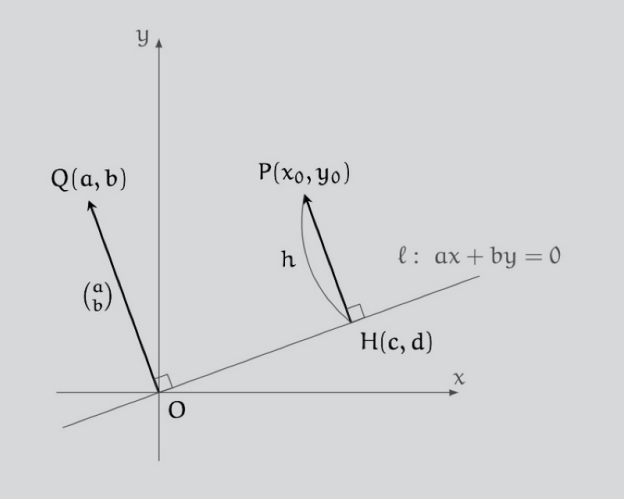
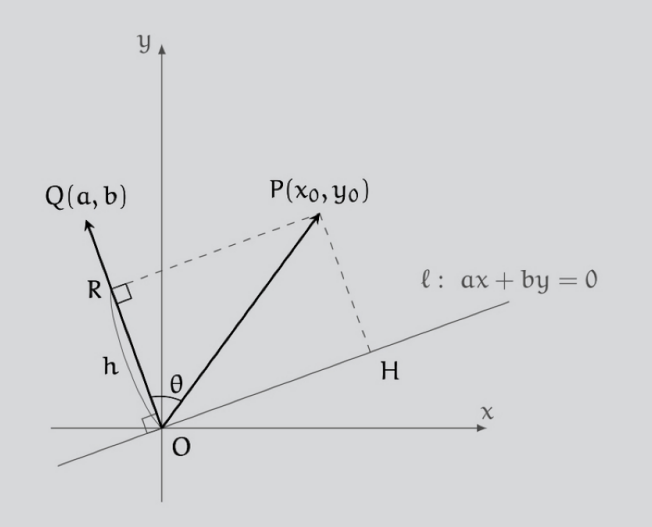
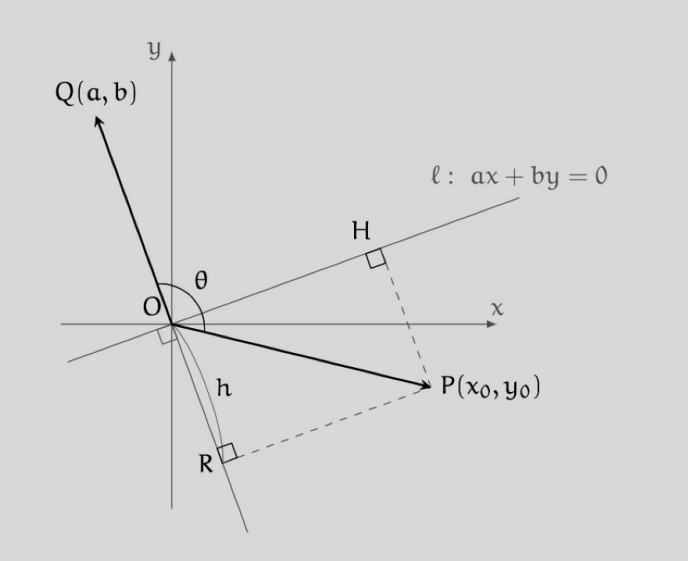

<body>
  <h1>AIの友達 数学の問題</h1>
<h3>覚え書き</h2>
<pre>
『数学ガールの秘密ノート ベクトルの真実』
結城浩 2015/11 SBクリエイティブ
ISBN 978-4-7973-8231-0

問題4-3 p.181 No.193 / p.259 No.271
点(x_0,y_0)と直線 ax+by=0 の距離 h を a,b,x_0,y_0 で表せ、ただし a!=0 または b!=0

解答4-3 p.259 No.271
別解 p.262 No.275
h=|ax_0+by_0|/√(a^2+b^2) 

No. の数字は kindle版の 位置No. です
問題の参照ページが二つあるのは、本文中の出題位置と巻末解答部での位置です
問題文はテキストでの参照用のメモです、定式化のものとは変わります。
</pre>

より、問題、解答、別解、を記します。
 
別解も最後まで記しましたが、
解答(シオン) との対照としては、
冒頭の二つのグラフぐらいか(カッコで付記したキャプションを含む)
あと数行(横線まで)
とするのがいいでしょう。
(もし別解も最後までつかうなら横線はいらないです)

  <h2>問題</h2>

点
<math>
  <mfenced>
    <msub><mi>x</mi><mn mathsize="small">0</mn></msub>
    <msub><mi>y</mi><mn mathsize="small">0</mn></msub>
  </mfenced>
</math>
と、直線
<math>
  <mi>a</mi><mo>&it;</mo><mi>x</mi>
  <mo>+</mo>
  <mi>b</mi><mo>&it;</mo><mi>y</mi>
  <mo>=</mo>
  <mn>0</mn> 
</math>
との距離 <math><mi>h</mi></math> を
<math>
  <mfenced open="" close="">
    <mi>a</mi>
    <mi>b</mi>
    <msub>
      <mi>x</mi>
      <mn mathsize="small">0</mn>
    </msub>
    <msub>
      <mi>y</mi>
      <mn mathsize="small">0</mn>
    </msub>
  </mfenced>
</math>
で表せ、
ただし
<math><mi>a</mi><mo>&ne;</mo><mn>0</mn></math>
または
<math><mi>b</mi><mo>&ne;</mo><mn>0</mn></math>
とする。

  <h2>解答 (シオン)</h2>

原点 <math><mi mathvariant="normal">O</mi></math> 、
点
<math>
  <mfenced>
    <msub><mi>x</mi><mn mathsize="small">0</mn></msub>
    <msub><mi>y</mi><mn mathsize="small">0</mn></msub>
  </mfenced>
</math>
を <math><mi mathvariant="normal">P</mi></math> 、
点
<math>
  <mfenced>
    <mi>a</mi>
    <mi>b</mi>
  </mfenced>
</math>
を <math><mi mathvariant="normal">Q</mi></math> とし、
 
直線
<math>
  <mi>a</mi><mo>&it;</mo><mi>x</mi>
  <mo>+</mo>
  <mi>b</mi><mo>&it;</mo><mi>y</mi>
  <mo>=</mo>
  <mn>0</mn> 
</math>
を <math><mi>l</mi></math> とする

点 <math><mi mathvariant="normal">P</mi></math> から直線 <math><mi>l</mi></math> に下ろした垂線のあしを  <math><mi mathvariant="normal">H</mi></math>
<math>
  <mfenced>
    <mi>c</mi>
    <mi>d</mi>
  </mfenced>
</math>
とする

<!--

 -->

求める  <math><mi>h</mi></math> は、
<math><mover><mi>HP</mi><mo>&rarr;</mo></mover></math> の内積で書くと

<math>
  <mrow>
    <mi>h</mi>

    <mo>=</mo>

    <mfenced open="|" close="|">
      <mover><mi>HP</mi><mo>&rarr;</mo></mover>
    </mfenced>
  </mrow>
</math>
 
<math>
  <mrow>
    <mspace width="2ex" />
    <mo>=</mo>

    <msqrt>
      <msup>
        <mfenced open="|" close="|">
          <mover><mi>HP</mi><mo>&rarr;</mo></mover>
        </mfenced>
        <mn>2</mn>
      </msup>
    </msqrt>
  </mrow>
</math>
 
<math>
  <mrow>
    <mspace width="2ex" />
    <mo>=</mo>

    <msqrt>
      <mover><mi>HP</mi><mo>&rarr;</mo></mover>
      <mo>&sdot;</mo>
      <mover><mi>HP</mi><mo>&rarr;</mo></mover>
    </msqrt>
    <mspace width="2em"/>
    <mfrac>
      <mspace width="3em">
      <mspace>
    </mfrac>
    <mspace width="1ex"/>
    <mtext>(1)</mtext>
  </mrow>
</math>

一方、直線  <math><mi>l</mi></math> の方程式
<math>
  <mi>a</mi><mo>&it;</mo><mi>x</mi>
  <mo>+</mo>
  <mi>b</mi><mo>&it;</mo><mi>y</mi>
  <mo>=</mo>
  <mn>0</mn> 
</math>
は内積で

<math>
  <mrow>
    <mfenced>
      <mtable>
        <mtr><mtd><mi>a</mi></mtd></mtr>
        <mtr><mtd><mi>b</mi></mtd></mtr>
      </mtable>
    </mfenced>
    <mo>&sdot;</mo>
    <mfenced>
      <mtable>
        <mtr><mtd><mi>x</mi></mtd></mtr>
        <mtr><mtd><mi>y</mi></mtd></mtr>
      </mtable>
    </mfenced>

    <mo>=</mo>
    <mn>0</mn>
  </mrow>
</math>

と書ける

内積が <math><mn>0</mn></math> ということは、
直線 <math><mi>l</mi></math> 上の任意の点 <math><mfenced><mi>x</mi><mi>y</mi></mfenced></math> について
 
ベクトル
<math>
  <mfenced>
    <mtable>
      <mtr><mtd><mi>a</mi></mtd></mtr>
      <mtr><mtd><mi>b</mi></mtd></mtr>
    </mtable>
  </mfenced>
</math>
と
<math>
  <mfenced>
    <mtable>
      <mtr><mtd><mi>x</mi></mtd></mtr>
      <mtr><mtd><mi>y</mi></mtd></mtr>
    </mtable>
  </mfenced>
</math>
は直交している

<!--

(参考) 一般に、直線と直交するベクトルのことを、その直線の<ruby>法線<rt>ほうせん</rt></ruby>ベクトルといいます。
言い換えると、法線ベクトルは方向ベクトルに直交するベクトルのことです。
ベクトル
<math>
  <mfenced>
    <mtable>
      <mtr><mtd><mi>a</mi></mtd></mtr>
      <mtr><mtd><mi>b</mi></mtd></mtr>
    </mtable>
  </mfenced>
</math>
は、直線
<math>
  <mi>a</mi><mo>&it;</mo><mi>x</mi>
  <mo>+</mo>
  <mi>b</mi><mo>&it;</mo><mi>y</mi>
  <mo>=</mo>
  <mn>0</mn> 
</math>
の法線ベクトルです。

 -->
 

<math><mover><mi>HP</mi><mo>&rarr;</mo></mover></math> は
<math>
  <mfenced>
    <mtable>
      <mtr><mtd><mi>a</mi></mtd></mtr>
      <mtr><mtd><mi>b</mi></mtd></mtr>
    </mtable>
  </mfenced>
</math>
と平行なので、ある実数 <math><mi>t</mi></math> として

<math>
  <mrow>
    <mover><mi>HP</mi><mo>&rarr;</mo></mover>

    <mo>=</mo>

    <mi>t</mi>
    <mo>&it;</mo>
    <mfenced>
      <mtable>
        <mtr><mtd><mi>a</mi></mtd></mtr>
        <mtr><mtd><mi>b</mi></mtd></mtr>
      </mtable>
    </mfenced>
  </mrow>
</math>

と書ける

<math><mover><mi>HP</mi><mo>&rarr;</mo></mover></math> の内積を計算するため、この <math><mi>t</mi></math> を求める

<math>
  <mrow>
    <mtext>
      上より
    </mtext>
    <mspace width="1em">

    <mi>t</mi>
    <mo>&it;</mo>
    <mfenced>
      <mtable>
        <mtr><mtd><mi>a</mi></mtd></mtr>
        <mtr><mtd><mi>b</mi></mtd></mtr>
      </mtable>
    </mfenced>

    <mo>=</mo>

    <mover><mi>HP</mi><mo>&rarr;</mo></mover>
    <mspace width="2em"/>
  </mrow>
</math>

<math>
  <mrow>
    <mspace width="5em"/>
    <mo>=</mo>

    <mover><mi>OP</mi><mo>&rarr;</mo></mover>
    <mo>-</mo>
    <mover><mi>OH</mi><mo>&rarr;</mo></mover>
  </mrow>
</math>

両辺、
<math>
  <mfenced>
    <mtable>
      <mtr><mtd><mi>a</mi></mtd></mtr>
      <mtr><mtd><mi>b</mi></mtd></mtr>
    </mtable>
  </mfenced>
</math>
との内積をとる

<math>
  <mrow>
    <mi>t</mi>
    <mo>&it;</mo>
    <mfenced>
      <mtable>
        <mtr><mtd><mi>a</mi></mtd></mtr>
        <mtr><mtd><mi>b</mi></mtd></mtr>
      </mtable>
    </mfenced>
    <mo>&sdot;</mo>
    <mfenced>
      <mtable>
        <mtr><mtd><mi>a</mi></mtd></mtr>
        <mtr><mtd><mi>b</mi></mtd></mtr>
      </mtable>
    </mfenced>

    <mo>=</mo>

    <mfenced>
      <mrow>
        <mover><mi>OP</mi><mo>&rarr;</mo></mover>
        <mo>-</mo>
        <mover><mi>OH</mi><mo>&rarr;</mo></mover>
      </mrow>
    </mfenced>

    <mo>&sdot;</mo>
    <mfenced>
      <mtable>
        <mtr><mtd><mi>a</mi></mtd></mtr>
        <mtr><mtd><mi>b</mi></mtd></mtr>
      </mtable>
    </mfenced>
  </mrow>
</math>
 
<math>
  <mrow>
    <mspace width="6em"/>
    <mo>=</mo>

    <mover><mi>OP</mi><mo>&rarr;</mo></mover>
    <mo>&sdot;</mo>
    <mfenced>
      <mtable>
        <mtr><mtd><mi>a</mi></mtd></mtr>
        <mtr><mtd><mi>b</mi></mtd></mtr>
      </mtable>
    </mfenced>

    <mo>-</mo>

    <mover><mi>OH</mi><mo>&rarr;</mo></mover>
    <mo>&sdot;</mo>
    <mfenced>
      <mtable>
        <mtr><mtd><mi>a</mi></mtd></mtr>
        <mtr><mtd><mi>b</mi></mtd></mtr>
      </mtable>
    </mfenced>
  </mrow>
</math>
 
<math>
  <mrow>
    <mspace width="6em">
    <mo>=</mo>

    <mover><mi>OP</mi><mo>&rarr;</mo></mover>

    <mo>&sdot;</mo>
    <mfenced>
      <mtable>
        <mtr><mtd><mi>a</mi></mtd></mtr>
        <mtr><mtd><mi>b</mi></mtd></mtr>
      </mtable>
    </mfenced>

    <mspace width="2em"/>
    <mover><mi>OH</mi><mo>&rarr;</mo></mover>
    <mtext>
      &thinsp;
      と
    </mtext>
    <mfenced>
      <mtable>
        <mtr><mtd><mi>a</mi></mtd></mtr>
        <mtr><mtd><mi>b</mi></mtd></mtr>
      </mtable>
    </mfenced>
    <mtext>
      &thinsp;
      は垂直、内積
      &thinsp;
    </mtext>
    <mn>0</mn>
  </mrow>
</math>
 
<math>
  <mrow>
    <mspace width="6em">
    <mo>=</mo>

    <mfenced>
      <mtable>
        <mtr><mtd><msub><mi>x</mi><mn mathsize="small">0</mn></msub></mtd></mtr>
        <mtr><mtd><msub><mi>y</mi><mn mathsize="small">0</mn></msub></mtd></mtr>
      </mtable>
    </mfenced>
    
    <mo>&sdot;</mo>
    <mfenced>
      <mtable>
        <mtr><mtd><mi>a</mi></mtd></mtr>
        <mtr><mtd><mi>b</mi></mtd></mtr>
      </mtable>
    </mfenced>
  </mrow>
</math>
 
<math>
  <mrow>
    <mspace width="3ex">

    <mi>t</mi>
    <mo>&it;</mo>
    <mfenced>
      <mrow>
        <mi>a</mi>
        <mo>&it;</mo>
        <mi>a</mi>
      
        <mo>+</mo>

        <mi>b</mi>
        <mo>&it;</mo>
        <mi>b</mi>
      </mrow>
    </mfenced>

    <mo>=</mo>

    <msub><mi>x</mi><mn mathsize="small">0</mn></msub>
    <mo>&it;</mo>
    <mi>a</mi>

    <mo>+</mo>

    <msub><mi>y</mi><mn mathsize="small">0</mn></msub>
    <mo>&it;</mo>
    <mi>b</mi>

    <mspace width="3em"/>
    <mtext>内積を成分で計算</mtext>
  </mrow>
</math>
 
<math>
  <mrow>
    <mspace width="3ex">

    <mi>t</mi>
    <mo>&it;</mo>
    <mfenced>
      <mrow>
        <msup><mi>a</mi><mn>2</mn></msup>
        <mo>+</mo>
        <msup><mi>b</mi><mn>2</mn></msup>
      </mrow>
    </mfenced>

    <mo>=</mo>

    <mi>a</mi>
    <mo>&it;</mo>
    <msub><mi>x</mi><mn mathsize="small">0</mn></msub>

    <mo>+</mo>

    <mi>b</mi>
    <mo>&it;</mo>
    <msub><mi>y</mi><mn mathsize="small">0</mn></msub>

    <mspace width="3em"/>
    <mtext>それを整理</mtext>
  </mrow>
</math>

ここで、
<math><mi>a</mi><mo>&ne;</mo><mn>0</mn></math>
または
<math><mi>b</mi><mo>&ne;</mo><mn>0</mn></math>
、
よって
<math>
  <msup><mi>a</mi><mn>2</mn></msup>
  <mo>+</mo>
  <msup><mi>b</mi><mn>2</mn></msup>
  <mo>&ne;</mo>
  <mn>0</mn>
</math>

両辺をそれで割って

<math>
  <mrow>
    <mspace width="2em" />

    <mi>t</mi>
    <mo>=</mo>

    <mstyle mathsize="130%">
      <mfrac>
        <mrow>
          <mi>a</mi>
          <mo>&it;</mo>
          <msub><mi>x</mi><mn mathsize="small">0</mn></msub>

          <mo>+</mo>

         <mi>b</mi>
         <mo>&it;</mo>
          <msub><mi>y</mi><mn mathsize="small">0</mn></msub>
        </mrow>
        <mrow>
          <msup><mi>a</mi><mn>2</mn></msup>
          <mo>+</mo>
          <msup><mi>b</mi><mn>2</mn></msup>
        </mrow>
      </mfrac>
    </mstyle>

    <mspace width="2em"/>
    <mfrac>
      <mspace width="3em">
      <mspace>
    </mfrac>
    <mspace width="1ex"/>
    <mtext>(2)</mtext>
  </mrow>
</math>

<math><mi>t</mi></math> が求められた、よって
<math><mover><mi>HP</mi><mo>&rarr;</mo></mover></math> 
は、

<math>
  <mrow>
    <mspace width="1em" />

    <mover><mi>HP</mi><mo>&rarr;</mo></mover>

    <mo>=</mo>

    <mi>t</mi>
    <mo>&it;</mo>
    <mfenced>
      <mtable>
        <mtr><mtd><mi>a</mi></mtd></mtr>
        <mtr><mtd><mi>b</mi></mtd></mtr>
      </mtable>
    </mfenced>

    <mo>=</mo>

    <mstyle mathsize="130%">
      <mfrac>
        <mrow>
          <mi>a</mi>
          <mo>&it;</mo>
          <msub><mi>x</mi><mn mathsize="small">0</mn></msub>
          <mo>+</mo>
          <mi>b</mi>
          <mo>&it;</mo>
          <msub><mi>y</mi><mn mathsize="small">0</mn></msub>
        </mrow>
        <mrow>
          <msup><mi>a</mi><mn>2</mn></msup>
          <mo>+</mo>
          <msup><mi>b</mi><mn>2</mn></msup>
        </mrow>
      </mfrac>
    </mstyle>

    <mo>&it;</mo>

    <mfenced>
      <mtable>
        <mtr><mtd><mi>a</mi></mtd></mtr>
        <mtr><mtd><mi>b</mi></mtd></mtr>
      </mtable>
    </mfenced>
  </mrow>
</math>

ということで <math><mi>h</mi></math> は

<math>
  <mrow>
    <mi>h</mi>
    <mo>=</mo>

    <msqrt>
      <mover><mi>HP</mi><mo>&rarr;</mo></mover>
      <mo>&sdot;</mo>
      <mover><mi>HP</mi><mo>&rarr;</mo></mover>
    </msqrt>

    <mspace width="6em"/>
    <mtext>(1) より</mtext>
  </mrow>
</math>
 
<math>
  <mrow>
    <mspace width="2ex" />
    <mo>=</mo>

    <msqrt>
      <msup><mi>t</mi><mn>2</mn></msup>
      <mo>&it;</mo>
      <mfenced>
        <mrow>
          <msup><mi>a</mi><mn>2</mn></msup>
          <mo>+</mo>
          <msup><mi>b</mi><mn>2</mn></msup>
        </mrow>
      </mfenced>
    </msqrt>

    <mspace width="5em"/>
    <mover><mi>HP</mi><mo>&rarr;</mo></mover>
    <mo>=</mo>
    <mi>t</mi>
    <mo>&it;</mo>
    <mfenced>
      <mtable>
        <mtr><mtd><mi>a</mi></mtd></mtr>
        <mtr><mtd><mi>b</mi></mtd></mtr>
      </mtable>
    </mfenced>
    <mtext>
      &thinsp;
      より
    </mtext>
  </mrow>
</math>
 
<math>
  <mrow>
    <mtext>
      &ensp;
    </mtext>
    <mo>=</mo>

    <msqrt>
      <mstyle mathsize="130%">
        <mfrac>
          <msup>
            <mfenced>
              <mrow>
                <mi>a</mi>
                <mo>&it;</mo>
                <msub><mi>x</mi><mn mathsize="small">0</mn></msub>
                <mo>+</mo>
                <mi>b</mi>
                <mo>&it;</mo>
                <msub><mi>y</mi><mn mathsize="small">0</mn></msub>
              </mrow>
            </mfenced>
            <mn>2</mn>
          </msup>

          <msup>
            <mfenced>
              <mrow>
                <msup><mi>a</mi><mn>2</mn></msup>
                <mo>+</mo>
                <msup><mi>b</mi><mn>2</mn></msup>
              </mrow>
            </mfenced>
            <mn>2</mn>
          </msup>
        </mfrac>
      </mstyle>

      <mo>&it;</mo>

      <mfenced>
        <mrow>
          <msup><mi>a</mi><mn>2</mn></msup>
          <mo>+</mo>
          <msup><mi>b</mi><mn>2</mn></msup>
        </mrow>
      </mfenced>
    </msqrt>

    <mspace width="2em"/>
    <mtext>(2) より</mtext>
  </mrow>
</math>
 
<math>
  <mrow>
    <mspace width="2ex" />
    <mo>=</mo>

    <msqrt>
      <mstyle mathsize="130%">
        <mfrac>
          <msup>
            <mfenced>
              <mrow>
                <mi>a</mi>
                <mo>&it;</mo>
                <msub><mi>x</mi><mn mathsize="small">0</mn></msub>
                <mo>+</mo>
                <mi>b</mi>
                <mo>&it;</mo>
                <msub><mi>y</mi><mn mathsize="small">0</mn></msub>
              </mrow>
            </mfenced>
            <mn>2</mn>
          </msup>
  
          <mrow>
            <msup><mi>a</mi><mn>2</mn></msup>
            <mo>+</mo>
            <msup><mi>b</mi><mn>2</mn></msup>
          </mrow>
        </mfrac>
      </mstyle>
    </msqrt>
  </mrow>
</math>
 
<math>
  <mrow>
    <mspace width="2ex" />
    <mo>=</mo>

    <mstyle mathsize="130%">
      <mfrac>
        <mfenced open="|" close="|">
          <mrow>
            <mi>a</mi>
            <mo>&it;</mo>
            <msub><mi>x</mi><mn mathsize="small">0</mn></msub>
            <mo>+</mo>
            <mi>b</mi>
            <mo>&it;</mo>
            <msub><mi>y</mi><mn mathsize="small">0</mn></msub>
          </mrow>
        </mfenced>
  
        <msqrt>
          <mrow>
            <msup><mi>a</mi><mn>2</mn></msup>
            <mo>+</mo>
            <msup><mi>b</mi><mn>2</mn></msup>
          </mrow>
        </msqrt>
      </mfrac>
    </mstyle>
  </mrow>
</math>

<math>
  <munder accentunder="false">
    <mrow>
      <mtext>
        A.
        &thinsp;
      </mtext>

      <mi>h</mi>
      <mo>=</mo>
    
      <mstyle mathsize="130%">
        <mfrac>
          <mfenced open="|" close="|">
            <mrow>
              <mi>a</mi>
              <mo>&it;</mo>
              <msub><mi>x</mi><mn mathsize="small">0</mn></msub>
              <mo>+</mo>
              <mi>b</mi>
              <mo>&it;</mo>
              <msub><mi>y</mi><mn mathsize="small">0</mn></msub>
            </mrow>
          </mfenced>
      
          <msqrt>
            <mrow>
              <msup><mi>a</mi><mn>2</mn></msup>
              <mo>+</mo>
              <msup><mi>b</mi><mn>2</mn></msup>
            </mrow>
          </msqrt>
        </mfrac>
      </mstyle>
    </mrow>
    <mo>&OverBar;</mo>
  </munder>
</math>

<!--
 -->

  <h2>別解 (サトミ)</h2>

=0)" width="326" from="p.263" style="margin-left: 2em;" />

<math>
  <mfenced>
    <mrow>
      <mi>cos</mi>
      <mo>&af;</mo>
      <mi>&theta;</mi>
      <mo>&ge;</mo>
      <mn>0</mn>
    </mrow>
  </mfenced>
</math> 

<math>
  <mfenced>
    <mrow>
      <mi>cos</mi>
      <mo>&af;</mo>
      <mi>&theta;</mi>
      <mo>&lt;</mo>
      <mn>0</mn>
    </mrow>
  </mfenced>
</math> 

原点 <math><mi mathvariant="normal">O</mi></math> 、
点
<math>
  <mfenced>
    <msub><mi>x</mi><mn mathsize="small">0</mn></msub>
    <msub><mi>y</mi><mn mathsize="small">0</mn></msub>
  </mfenced>
</math>
を <math><mi mathvariant="normal">P</mi></math> 、
点
<math>
  <mfenced>
    <mi>a</mi>
    <mi>b</mi>
  </mfenced>
</math>
を <math><mi mathvariant="normal">Q</mi></math> とし
 
直線
<math>
  <mi>a</mi><mo>&it;</mo><mi>x</mi>
  <mo>+</mo>
  <mi>b</mi><mo>&it;</mo><mi>y</mi>
  <mo>=</mo>
  <mn>0</mn> 
</math>
を <math><mi>l</mi></math> とする

ベクトル
<math><mover><mi>OP</mi><mo>&rarr;</mo></mover></math>
と
<math><mover><mi>OQ</mi><mo>&rarr;</mo></mover></math>
のなす角を <math><mi>&theta;</mi></math> とし
 
点 <math><mi mathvariant="normal">P</mi></math> から
直線 <math><mi mathvariant="normal">OQ</mi></math> に下ろした
垂線のあしを <math><mi mathvariant="normal">R</mi></math> とする

点 <math><mi mathvariant="normal">P</mi></math> から
直線 <math><mi>l</mi></math> に下ろした垂線のあしを <math><mi mathvariant="normal">H</mi></math> とする

<!--

角 <math><mi>&theta;</mi></math> の値によって
<math>
  <mi>cos</mi>
  <mo>&af;</mo>
  <mi>&theta;</mi>
</math> 
の符号が変わるので、
<math>
  <mi>cos</mi>
  <mo>&af;</mo>
  <mi>&theta;</mi>
  <mo>&ge;</mo>
  <mn>0</mn>
</math> 
の場合と、
<math>
  <mi>cos</mi>
  <mo>&af;</mo>
  <mi>&theta;</mi>
  <mo>&lt;</mo>
  <mn>0</mn>
</math> 
の場合とに分けて図を描きます。

 -->

どちらの図でも、
点 <math><mi mathvariant="normal">P</mi></math> と
直線 <math><mi>l</mi></math> の距離 <math><mi>h</mi></math> は
線分 <math><mi mathvariant="normal">HP</mi></math> の長さになる
 
それは線分 <math><mi mathvariant="normal">OR</mi></math> の長さに等しい
<!--
 (長方形の対辺)
 -->

線分 <math><mi mathvariant="normal">OR</mi></math> の長さは

<math>
  <mrow>
    <mi>h</mi>

    <mo>=</mo>

    <mo>{</mo>
    <mtable>
      <mtr>
        <mtd>
          <mo>+</mo>
          <mfenced open="|" close="|">
            <mover><mi>OP</mi><mo>&rarr;</mo></mover>
          </mfenced>
          <mo>&it;</mo>
          <mrow>
            <mi>cos</mi><mo>&af;</mo><mi>&theta;</mi>
          </mrow>
          <mspace width="2em"/>
          <mfenced>
            <mrow>
              <mi>cos</mi><mo>&af;</mo><mi>&theta;</mi>
              <mo>&ge;</mo>
              <mn>0</mn>
            </mrow>
          </mfenced>
        </mtd>
      </mtr>

      <mtr>
        <mtd>
          <mo>-</mo>
          <mfenced open="|" close="|">
            <mover><mi>OP</mi><mo>&rarr;</mo></mover>
          </mfenced>
          <mo>&it;</mo>
          <mrow>
            <mi>cos</mi><mo>&af;</mo><mi>&theta;</mi>
          </mrow>
          <mspace width="2em"/>
          <mfenced>
            <mrow>
              <mi>cos</mi><mo>&af;</mo><mi>&theta;</mi>
              <mo>&lt;</mo>
              <mn>0</mn>
            </mrow>
          </mfenced>
        </mtd>
      </mtr>
    </mtable>
  </mrow>
</math>

これは絶対値をとって

<math>
  <mrow>
    <mi>h</mi>

    <mo>=</mo>

    <mfenced open="|" close="|">
      <mover><mi>OP</mi><mo>&rarr;</mo></mover>
    </mfenced>
    <mo>&it;</mo>
    <mfenced open="|" close="|">
      <mrow>
        <mi>cos</mi><mo>&af;</mo><mi>&theta;</mi>
      </mrow>
    </mfenced>
  </mrow>
</math>

一方、
<math><mover><mi>OQ</mi><mo>&rarr;</mo></mover></math>
と
<math><mover><mi>OP</mi><mo>&rarr;</mo></mover></math>
の内積の絶対値は

<math>
  <mrow>
    <mfenced open="|" close="|">
      <mrow>
        <mover><mi>OQ</mi><mo>&rarr;</mo></mover>
        <mo>&sdot;</mo>
        <mover><mi>OP</mi><mo>&rarr;</mo></mover>
      </mrow>
    </mfenced>

    <mo>=</mo>

    <mfenced open="|" close="|">
      <mrow>
        <mover><mi>OQ</mi><mo>&rarr;</mo></mover>
      </mrow>
    </mfenced>
    <mo>&it;</mo>
    <munder accentunder="false">
      <mrow>
        <mfenced open="|" close="|">
          <mrow>
            <mover><mi>OP</mi><mo>&rarr;</mo></mover>
          </mrow>
        </mfenced>
        <mo>&it;</mo>
        <mfenced open="|" close="|">
          <mrow>
            <mi>cos</mi><mo>&af;</mo><mi>&theta;</mi>
          </mrow>
        </mfenced>
      </mrow>

      <mo>&UnderBar;</mo>
    </munder>
  </mrow>
</math>

上より下線部は <math><mi>h</mi></math> に等しいので

<math>
  <mrow>
    <mfenced open="|" close="|">
      <mrow>
        <mover><mi>OQ</mi><mo>&rarr;</mo></mover>
        <mo>&sdot;</mo>
        <mover><mi>OP</mi><mo>&rarr;</mo></mover>
      </mrow>
    </mfenced>

    <mo>=</mo>

    <mfenced open="|" close="|">
      <mrow>
        <mover><mi>OQ</mi><mo>&rarr;</mo></mover>
      </mrow>
    </mfenced>
    <mo>&it;</mo>
    <mspace width="1ex" />
    <mi>h</mi>
  </mrow>
</math>

成分で書くと

<math>
  <mrow>
    <mfenced open="|" close="|">
      <mrow>
        <mfenced>
          <mtable>
            <mtr><mtd><mi>a</mi></mtd></mtr>
            <mtr><mtd><mi>b</mi></mtd></mtr>
          </mtable>
        </mfenced>

        <mo>&sdot;</mo>
        
        <mfenced>
          <mtable>
            <mtr><mtd><msub><mi>x</mi><mn mathsize="small">0</mn></msub></mtd></mtr>
            <mtr><mtd><msub><mi>y</mi><mn mathsize="small">0</mn></msub></mtd></mtr>
          </mtable>
        </mfenced>
      </mrow>
    </mfenced>

    <mo>=</mo>

  </mrow>
</math>
 
<math>
  <mrow>
    <mspace width="1ex"/>

    <mfenced open="|" close="|">
      <mrow>
        <mspace width="1ex"/>
        <mi>a</mi>
        <mo>&it;</mo>
        <msub><mi>x</mi><mn mathsize="small">0</mn></msub>

        <mo>+</mo>

        <mi>b</mi>
        <mo>&it;</mo>
        <msub><mi>y</mi><mn mathsize="small">0</mn></msub>
        <mspace width="1ex"/>
      </mrow>
    </mfenced>

    <mspace width="1ex"/>
    <mo>=</mo>

    <msqrt>
      <mrow>
        <msup><mi>a</mi><mn>2</mn></msup>
        <mo>+</mo>
        <msup><mi>b</mi><mn>2</mn></msup>
      </mrow>
    </msqrt>
    <mo>&it;</mo>
    <mspace width="1ex" />
    <mi>h</mi>
  </mrow>
</math>

ここで
<math><mi>a</mi><mo>&ne;</mo><mn>0</mn></math>
または
<math><mi>b</mi><mo>&ne;</mo><mn>0</mn></math>
なので
<math>
  <msqrt>
    <msup><mi>a</mi><mn>2</mn></msup>
    <mo>+</mo>
    <msup><mi>b</mi><mn>2</mn></msup>
  </msqrt>
  <mo>&ne;</mo>
  <mn>0</mn>
</math>

両辺それで割って交換すると

<math>
  <mrow>
    <mi>h</mi>
    <mo>=</mo>
  
    <mstyle mathsize="130%">
      <mfrac>
        <mfenced open="|" close="|">
          <mrow>
            <mi>a</mi>
            <mo>&it;</mo>
            <msub><mi>x</mi><mn mathsize="small">0</mn></msub>
            <mo>+</mo>
            <mi>b</mi>
            <mo>&it;</mo>
            <msub><mi>y</mi><mn mathsize="small">0</mn></msub>
          </mrow>
        </mfenced>
    
        <msqrt>
          <mrow>
            <msup><mi>a</mi><mn>2</mn></msup>
            <mo>+</mo>
            <msup><mi>b</mi><mn>2</mn></msup>
          </mrow>
        </msqrt>
      </mfrac>
    </mstyle>
  </mrow>
</math>

<math>
  <munder accentunder="false">
    <mrow>
      <mtext>
        A.
        &thinsp;
      </mtext>

      <mi>h</mi>
      <mo>=</mo>

      <mstyle mathsize="130%">
        <mfrac>
          <mfenced open="|" close="|">
            <mrow>
              <mi>a</mi>
              <mo>&it;</mo>
              <msub><mi>x</mi><mn mathsize="small">0</mn></msub>
              <mo>+</mo>
              <mi>b</mi>
              <mo>&it;</mo>
              <msub><mi>y</mi><mn mathsize="small">0</mn></msub>
            </mrow>
          </mfenced>

          <msqrt>
            <mrow>
              <msup><mi>a</mi><mn>2</mn></msup>
              <mo>+</mo>
              <msup><mi>b</mi><mn>2</mn></msup>
            </mrow>
          </msqrt>
        </mfrac>
      </mstyle>
    </mrow>
    <mo>&OverBar;</mo>
  </munder>
</math>

</body>
<!-- 以下は本から写したの、儘、それを参考に上に提出用の定式化をした
<!DOCTYPE html>
<html>
<head>
  <title>AIの友達 数学の問題</title>
  
</head>
<body>
  <h1>AIの友達 数学の問題</h1>
<pre>
『数学ガールの秘密ノート ベクトルの真実』
結城浩 2015/11 SBクリエイティブ
ISBN 978-4-7973-8231-0

問題4-3 p.181 No.193 / p.259 No.271
点(x_0,y_0)と直線 ax+by=0 の距離 h を a,b,x_0,y_0 で表せ、ただし a!=0 または b!=0

解答4-3 p.259 No.271
別解 p.262 No.275
h=|ax_0+by_0|/√(a^2+b^2) 

No. の数字は kindle版の 位置No. です
問題の参照ページが二つあるのは、本文中の出題位置と巻末解答部での位置です
問題文はテキストでの参照用のメモです、定式化のものとは変わります。
</pre>

  <h2>問題</h2>

点
<math>
  <mfenced>
    <msub><mi>x</mi><mn>0</mn></msub>
    <msub><mi>y</mi><mn>0</mn></msub>
  </mfenced>
</math>
と、直線
<math>
  <mi>a</mi><mo>&it;</mo><mi>x</mi>
  <mo>+</mo>
  <mi>b</mi><mo>&it;</mo><mi>y</mi>
  <mo>=</mo>
  <mn>0</mn> 
</math>
との距離を <math><mi>h</mi></math> とします。
この時、点と直線の距離 <math><mi>h</mi></math> を
<math>
  <mfenced open="" close="" separators=", ">
    <mi>a</mi>
    <mi>b</mi>
    <msub>
      <mi>x</mi>
      <mn>0</mn>
    </msub>
    <msub>
      <mi>y</mi>
      <mn>0</mn>
    </msub>
  </mfenced>
</math>
で表してください。ただし、
<math><mi>a</mi><mo>&ne;</mo><mn>0</mn></math>
または
<math><mi>b</mi><mo>&ne;</mo><mn>0</mn></math>
とします。

  <h2>解答</h2>

点
<math>
  <mfenced>
    <msub><mi>x</mi><mn>0</mn></msub>
    <msub><mi>y</mi><mn>0</mn></msub>
  </mfenced>
</math>
を <math><mi mathvariant="normal">P</mi></math> とし、
点
<math>
  <mfenced>
    <mi>a</mi>
    <mi>b</mi>
  </mfenced>
</math>
を <math><mi mathvariant="normal">Q</mi></math> とし、
直線
<math>
  <mi>a</mi><mo>&it;</mo><mi>x</mi>
  <mo>+</mo>
  <mi>b</mi><mo>&it;</mo><mi>y</mi>
  <mo>=</mo>
  <mn>0</mn> 
</math>
を <math><mi>l</mi></math> とします。
また、点 <math><mi mathvariant="normal">P</mi></math> から直線 <math><mi>l</mi></math> に下ろした垂線の足を  <math><mi mathvariant="normal">H</mi></math>
 <math>
  <mfenced>
    <mi>c</mi>
    <mi>d</mi>
  </mfenced>
</math>
とします。

原点 <math><mi mathvariant="normal">O</mi></math> とする

求める点と直線の距離  <math><mi>h</mi></math> は、以下のように、
ベクトル <math><mover><mi>HP</mi><mo>&rarr;</mo></mover></math> の内積で表すことができます。

<math>
  <mrow>
    <mi>h</mi>

    <mo>=</mo>

    <mfenced open="|" close="|">
      <mover><mi>HP</mi><mo>&rarr;</mo></mover>
    </mfenced>
  </mrow>
</math>
 
<math>
  <mrow>
    <mspace width="2ex" />
    <mo>=</mo>

    <msqrt>
      <msup>
        <mfenced open="|" close="|">
          <mover><mi>HP</mi><mo>&rarr;</mo></mover>
        </mfenced>
        <mn>2</mn>
      </msup>
    </msqrt>
  </mrow>
</math>
 
<math>
  <mrow>
    <mspace width="2ex" />
    <mo>=</mo>

    <msqrt>
      <mover><mi>HP</mi><mo>&rarr;</mo></mover>
      <mo>&sdot;</mo>
      <mover><mi>HP</mi><mo>&rarr;</mo></mover>
    </msqrt>
    <mspace width="2em"/>
    <mtext>…… (1)</mtext>
  </mrow>
</math>

ところで、直線  <math><mi>l</mi></math> の方程式
<math>
  <mi>a</mi><mo>&it;</mo><mi>x</mi>
  <mo>+</mo>
  <mi>b</mi><mo>&it;</mo><mi>y</mi>
  <mo>=</mo>
  <mn>0</mn> 
</math>
は、2つのベクトル
<math>
  <mfenced>
    <mtable>
      <mtr><mtd><mi>a</mi></mtd></mtr>
      <mtr><mtd><mi>b</mi></mtd></mtr>
    </mtable>
  </mfenced>
</math>
と
<math>
  <mfenced>
    <mtable>
      <mtr><mtd><mi>x</mi></mtd></mtr>
      <mtr><mtd><mi>y</mi></mtd></mtr>
    </mtable>
  </mfenced>
</math>
の内積として、

<math>
  <mrow>
    <mfenced>
      <mtable>
        <mtr><mtd><mi>a</mi></mtd></mtr>
        <mtr><mtd><mi>b</mi></mtd></mtr>
      </mtable>
    </mfenced>
    <mo>&sdot;</mo>
    <mfenced>
      <mtable>
        <mtr><mtd><mi>x</mi></mtd></mtr>
        <mtr><mtd><mi>y</mi></mtd></mtr>
      </mtable>
    </mfenced>

    <mo>=</mo>
    <mn>0</mn>
  </mrow>
</math>

と書くことができます。

内積が <math><mn>0</mn></math> ですから、
直線 <math><mi>l</mi></math> 上の任意の点を <math><mfenced><mi>x</mi><mi>y</mi></mfenced></math> としたとき、
2つベクトル
<math>
  <mfenced>
    <mtable>
      <mtr><mtd><mi>a</mi></mtd></mtr>
      <mtr><mtd><mi>b</mi></mtd></mtr>
    </mtable>
  </mfenced>
</math>
と
<math>
  <mfenced>
    <mtable>
      <mtr><mtd><mi>x</mi></mtd></mtr>
      <mtr><mtd><mi>y</mi></mtd></mtr>
    </mtable>
  </mfenced>
</math>
は直交していることになります。

(参考) 一般に、直線と直交するベクトルのことを、その直線の<ruby>法線<rt>ほうせん</rt></ruby>ベクトルといいます。
言い換えると、法線ベクトルは方向ベクトルに直交するベクトルのことです。
ベクトル
<math>
  <mfenced>
    <mtable>
      <mtr><mtd><mi>a</mi></mtd></mtr>
      <mtr><mtd><mi>b</mi></mtd></mtr>
    </mtable>
  </mfenced>
</math>
は、直線
<math>
  <mi>a</mi><mo>&it;</mo><mi>x</mi>
  <mo>+</mo>
  <mi>b</mi><mo>&it;</mo><mi>y</mi>
  <mo>=</mo>
  <mn>0</mn> 
</math>
の法線ベクトルです。

ベクトル <math><mover><mi>HP</mi><mo>&rarr;</mo></mover></math> はベクトル
<math>
  <mfenced>
    <mtable>
      <mtr><mtd><mi>a</mi></mtd></mtr>
      <mtr><mtd><mi>b</mi></mtd></mtr>
    </mtable>
  </mfenced>
</math>
と平行なので、<math><mi>t</mi></math> をある実数として、

<math>
  <mrow>
    <mover><mi>HP</mi><mo>&rarr;</mo></mover>

    <mo>=</mo>

    <mi>t</mi>
    <mo>&it;</mo>
    <mfenced>
      <mtable>
        <mtr><mtd><mi>a</mi></mtd></mtr>
        <mtr><mtd><mi>b</mi></mtd></mtr>
      </mtable>
    </mfenced>
  </mrow>
</math>

と書くことができます。
<math><mover><mi>HP</mi><mo>&rarr;</mo></mover></math> の内積を使って <math><mi>h</mi></math> を求めるため、まずこの実数 <math><mi>t</mi></math> を求めましょう。

<math>
  <mrow>
    <mspace width="2em">
    <mover><mi>HP</mi><mo>&rarr;</mo></mover>

    <mo>=</mo>

    <mi>t</mi>
    <mo>&it;</mo>
    <mfenced>
      <mtable>
        <mtr><mtd><mi>a</mi></mtd></mtr>
        <mtr><mtd><mi>b</mi></mtd></mtr>
      </mtable>
    </mfenced>

    <mspace width="2em"/>
    <mtext>上の式より</mtext>
  </mrow>
</math>
 
<math>
  <mrow>
    <mover><mi>OP</mi><mo>&rarr;</mo></mover>
    <mo>-</mo>
    <mover><mi>OH</mi><mo>&rarr;</mo></mover>

    <mo>=</mo>

    <mi>t</mi>
    <mo>&it;</mo>
    <mfenced>
      <mtable>
        <mtr><mtd><mi>a</mi></mtd></mtr>
        <mtr><mtd><mi>b</mi></mtd></mtr>
      </mtable>
    </mfenced>

    <mspace width="2em"/>
    <mover><mi>HP</mi><mo>&rarr;</mo></mover>
    <mtext>をベクトルの差で表した</mtext>
  </mrow>
</math>

ここで、両辺のベクトルと
<math>
  <mfenced>
    <mtable>
      <mtr><mtd><mi>a</mi></mtd></mtr>
      <mtr><mtd><mi>b</mi></mtd></mtr>
    </mtable>
  </mfenced>
</math>
との内積をとります。

<math>
  <mrow>
    <mspace width="1.5em">

    <mfenced>
      <mrow>
        <mover><mi>OP</mi><mo>&rarr;</mo></mover>
        <mo>-</mo>
        <mover><mi>OH</mi><mo>&rarr;</mo></mover>
      </mrow>
    </mfenced>

    <mo>&sdot;</mo>
    <mfenced>
      <mtable>
        <mtr><mtd><mi>a</mi></mtd></mtr>
        <mtr><mtd><mi>b</mi></mtd></mtr>
      </mtable>
    </mfenced>

    <mo>=</mo>

    <mi>t</mi>
    <mo>&it;</mo>
    <mfenced>
      <mtable>
        <mtr><mtd><mi>a</mi></mtd></mtr>
        <mtr><mtd><mi>b</mi></mtd></mtr>
      </mtable>
    </mfenced>
    <mo>&sdot;</mo>
    <mfenced>
      <mtable>
        <mtr><mtd><mi>a</mi></mtd></mtr>
        <mtr><mtd><mi>b</mi></mtd></mtr>
      </mtable>
    </mfenced>

    <mspace width="2em"/>
    <mtext>内積を取った</mtext>
</math>
 
<math>
  <mrow>
    <mover><mi>OP</mi><mo>&rarr;</mo></mover>
    <mo>&sdot;</mo>
    <mfenced>
      <mtable>
        <mtr><mtd><mi>a</mi></mtd></mtr>
        <mtr><mtd><mi>b</mi></mtd></mtr>
      </mtable>
    </mfenced>

    <mo>-</mo>

    <mover><mi>OH</mi><mo>&rarr;</mo></mover>
    <mo>&sdot;</mo>
    <mfenced>
      <mtable>
        <mtr><mtd><mi>a</mi></mtd></mtr>
        <mtr><mtd><mi>b</mi></mtd></mtr>
      </mtable>
    </mfenced>

    <mo>=</mo>

    <mi>t</mi>
    <mo>&it;</mo>
    <mfenced>
      <mtable>
        <mtr><mtd><mi>a</mi></mtd></mtr>
        <mtr><mtd><mi>b</mi></mtd></mtr>
      </mtable>
    </mfenced>
    <mo>&sdot;</mo>
    <mfenced>
      <mtable>
        <mtr><mtd><mi>a</mi></mtd></mtr>
        <mtr><mtd><mi>b</mi></mtd></mtr>
      </mtable>
    </mfenced>

    <mspace width="2em"/>
    <mtext>カッコを外して展開した</mtext>
</math>
 
<math>
  <mrow>
    <mspace width="5em">

    <mover><mi>OP</mi><mo>&rarr;</mo></mover>

    <mo>&sdot;</mo>
    <mfenced>
      <mtable>
        <mtr><mtd><mi>a</mi></mtd></mtr>
        <mtr><mtd><mi>b</mi></mtd></mtr>
      </mtable>
    </mfenced>

    <mo>=</mo>

    <mi>t</mi>
    <mo>&it;</mo>
    <mfenced>
      <mtable>
        <mtr><mtd><mi>a</mi></mtd></mtr>
        <mtr><mtd><mi>b</mi></mtd></mtr>
      </mtable>
    </mfenced>
    <mo>&sdot;</mo>
    <mfenced>
      <mtable>
        <mtr><mtd><mi>a</mi></mtd></mtr>
        <mtr><mtd><mi>b</mi></mtd></mtr>
      </mtable>
    </mfenced>

    <mspace width="2em"/>
    <mover><mi>OH</mi><mo>&rarr;</mo></mover>
    <mtext>
      &thinsp;
      と
    </mtext>
    <mfenced>
      <mtable>
        <mtr><mtd><mi>a</mi></mtd></mtr>
        <mtr><mtd><mi>b</mi></mtd></mtr>
      </mtable>
    </mfenced>
    <mtext>
      &thinsp;
      は垂直なので内積は
      &thinsp;
    </mtext>
    <mn>0</mn>
</math>
 
<math>
  <mrow>
    <mspace width="4em">

    <mfenced>
      <mtable>
        <mtr><mtd><msub><mi>x</mi><mn>0</mn></msub></mtd></mtr>
        <mtr><mtd><msub><mi>y</mi><mn>0</mn></msub></mtd></mtr>
      </mtable>
    </mfenced>
    
    <mo>&sdot;</mo>
    <mfenced>
      <mtable>
        <mtr><mtd><mi>a</mi></mtd></mtr>
        <mtr><mtd><mi>b</mi></mtd></mtr>
      </mtable>
    </mfenced>

    <mo>=</mo>

    <mi>t</mi>
    <mo>&it;</mo>
    <mfenced>
      <mtable>
        <mtr><mtd><mi>a</mi></mtd></mtr>
        <mtr><mtd><mi>b</mi></mtd></mtr>
      </mtable>
    </mfenced>
    <mo>&sdot;</mo>
    <mfenced>
      <mtable>
        <mtr><mtd><mi>a</mi></mtd></mtr>
        <mtr><mtd><mi>b</mi></mtd></mtr>
      </mtable>
    </mfenced>

    <mspace width="2em"/>
    <mover><mi>OP</mi><mo>&rarr;</mo></mover>
    <mo>=</mo>
    <mfenced>
      <mtable>
        <mtr><mtd><msub><mi>x</mi><mn>0</mn></msub></mtd></mtr>
        <mtr><mtd><msub><mi>y</mi><mn>0</mn></msub></mtd></mtr>
      </mtable>
    </mfenced>
    <mtext>
      &thinsp;
      だから
    </mtext>
</math>
 
<math>
  <mrow>
    <mspace width="6em">

    <msub><mi>x</mi><mn>0</mn></msub>
    <mo>&it;</mo>
    <mi>a</mi>

    <mo>+</mo>

    <msub><mi>y</mi><mn>0</mn></msub>
    <mo>&it;</mo>
    <mi>b</mi>

    <mo>=</mo>

    <mi>t</mi>
    <mo>&it;</mo>
    <mfenced>
      <mrow>
        <mi>a</mi>
        <mo>&it;</mo>
        <mi>a</mi>
      
        <mo>+</mo>

        <mi>b</mi>
        <mo>&it;</mo>
        <mi>b</mi>
      </mrow>
    </mfenced>

    <mspace width="2em"/>
    <mtext>内積を成分で計算した</mtext>
</math>
 
<math>
  <mrow>
    <mspace width="6em">

    <mi>a</mi>
    <mo>&it;</mo>
    <msub><mi>x</mi><mn>0</mn></msub>

    <mo>+</mo>

    <mi>b</mi>
    <mo>&it;</mo>
    <msub><mi>y</mi><mn>0</mn></msub>

    <mo>=</mo>

    <mi>t</mi>
    <mo>&it;</mo>
    <mfenced>
      <mrow>
        <msup><mi>a</mi><mn>2</mn></msup>
        <mo>+</mo>
        <msup><mi>b</mi><mn>2</mn></msup>
      </mrow>
    </mfenced>

    <mspace width="2em"/>
    <mtext>整理した</mtext>
</math>
 
<math>
  <mrow>
    <mspace width="6em">

    <mi>t</mi>
    <mo>&it;</mo>
    <mfenced>
      <mrow>
        <msup><mi>a</mi><mn>2</mn></msup>
        <mo>+</mo>
        <msup><mi>b</mi><mn>2</mn></msup>
      </mrow>
    </mfenced>

    <mo>=</mo>

    <mi>a</mi>
    <mo>&it;</mo>
    <msub><mi>x</mi><mn>0</mn></msub>

    <mo>+</mo>

    <mi>b</mi>
    <mo>&it;</mo>
    <msub><mi>y</mi><mn>0</mn></msub>

    <mspace width="2em"/>
    <mtext>両辺を交換した</mtext>
  </mrow>
</math>

ここで、
<math><mi>a</mi><mo>&ne;</mo><mn>0</mn></math>
または
<math><mi>b</mi><mo>&ne;</mo><mn>0</mn></math>
なので
<math>
  <msup><mi>a</mi><mn>2</mn></msup>
  <mo>+</mo>
  <msup><mi>b</mi><mn>2</mn></msup>
  <mo>&ne;</mo>
  <mn>0</mn>
</math>
となり、
両辺を
<math>
  <msup><mi>a</mi><mn>2</mn></msup>
  <mo>+</mo>
  <msup><mi>b</mi><mn>2</mn></msup>
</math>
で割ると
<math><mi>t</mi></math>
を得ます。

<math>
  <mrow>
    <mspace width="2em" />

    <mi>t</mi>
    <mo>=</mo>

    <mstyle mathsize="130%">
      <mfrac>
        <mrow>
          <mi>a</mi>
          <mo>&it;</mo>
          <msub><mi>x</mi><mn>0</mn></msub>

          <mo>+</mo>

         <mi>b</mi>
         <mo>&it;</mo>
          <msub><mi>y</mi><mn>0</mn></msub>
        </mrow>
        <mrow>
          <msup><mi>a</mi><mn>2</mn></msup>
          <mo>+</mo>
          <msup><mi>b</mi><mn>2</mn></msup>
        </mrow>
      </mfrac>
    </mstyle>

    <mspace width="2em"/>
    <mtext>…… (2)</mtext>
  </mrow>
</math>

これで <math><mi>t</mi></math> が得られたので
<math><mover><mi>HP</mi><mo>&rarr;</mo></mover></math> 
は、

<math>
  <mrow>
    <mspace width="1em" />

    <mover><mi>HP</mi><mo>&rarr;</mo></mover>

    <mo>=</mo>

    <mi>t</mi>
    <mo>&it;</mo>
    <mfenced>
      <mtable>
        <mtr><mtd><mi>a</mi></mtd></mtr>
        <mtr><mtd><mi>b</mi></mtd></mtr>
      </mtable>
    </mfenced>

    <mo>=</mo>

    <mstyle mathsize="130%">
      <mfrac>
        <mrow>
          <mi>a</mi>
          <mo>&it;</mo>
          <msub><mi>x</mi><mn>0</mn></msub>
          <mo>+</mo>
          <mi>b</mi>
          <mo>&it;</mo>
          <msub><mi>y</mi><mn>0</mn></msub>
        </mrow>
        <mrow>
          <msup><mi>a</mi><mn>2</mn></msup>
          <mo>+</mo>
          <msup><mi>b</mi><mn>2</mn></msup>
        </mrow>
      </mfrac>
    </mstyle>

    <mo>&it;</mo>

    <mfenced>
      <mtable>
        <mtr><mtd><mi>a</mi></mtd></mtr>
        <mtr><mtd><mi>b</mi></mtd></mtr>
      </mtable>
    </mfenced>
  </mrow>
</math>

ということがわかりました。

<math>
  <mrow>
    <mi>h</mi>
    <mo>=</mo>

    <msqrt>
      <mover><mi>HP</mi><mo>&rarr;</mo></mover>
      <mo>&sdot;</mo>
      <mover><mi>HP</mi><mo>&rarr;</mo></mover>
    </msqrt>

    <mspace width="7em"/>
    <mtext>(1) から</mtext>
  </mrow>
</math>
 
<math>
  <mrow>
    <mspace width="2ex" />
    <mo>=</mo>

    <msqrt>
      <msup><mi>t</mi><mn>2</mn></msup>
      <mo>&it;</mo>
      <mfenced>
        <mrow>
          <msup><mi>a</mi><mn>2</mn></msup>
          <mo>+</mo>
          <msup><mi>b</mi><mn>2</mn></msup>
        </mrow>
      </mfenced>
    </msqrt>

    <mspace width="6em"/>
    <mover><mi>HP</mi><mo>&rarr;</mo></mover>
    <mo>=</mo>
    <mi>t</mi>
    <mo>&it;</mo>
    <mfenced>
      <mtable>
        <mtr><mtd><mi>a</mi></mtd></mtr>
        <mtr><mtd><mi>b</mi></mtd></mtr>
      </mtable>
    </mfenced>
    <mtext>
      &thinsp;
      から
    </mtext>
  </mrow>
</math>
 
<math>
  <mrow>
    <mtext>
      &ensp;
    </mtext>
    <mo>=</mo>

    <msqrt>
      <mstyle mathsize="130%">
        <mfrac>
          <msup>
            <mfenced>
              <mrow>
                <mi>a</mi>
                <mo>&it;</mo>
                <msub><mi>x</mi><mn>0</mn></msub>
                <mo>+</mo>
                <mi>b</mi>
                <mo>&it;</mo>
                <msub><mi>y</mi><mn>0</mn></msub>
              </mrow>
            </mfenced>
            <mn>2</mn>
          </msup>

          <msup>
            <mfenced>
              <mrow>
                <msup><mi>a</mi><mn>2</mn></msup>
                <mo>+</mo>
                <msup><mi>b</mi><mn>2</mn></msup>
              </mrow>
            </mfenced>
            <mn>2</mn>
          </msup>
        </mfrac>
      </mstyle>

      <mo>&it;</mo>

      <mfenced>
        <mrow>
          <msup><mi>a</mi><mn>2</mn></msup>
          <mo>+</mo>
          <msup><mi>b</mi><mn>2</mn></msup>
        </mrow>
      </mfenced>
    </msqrt>

    <mspace width="2em"/>
    <mtext>(2) から</mtext>
  </mrow>
</math>
 
<math>
  <mrow>
    <mspace width="2ex" />
    <mo>=</mo>

    <msqrt>
      <mstyle mathsize="130%">
        <mfrac>
          <msup>
            <mfenced>
              <mrow>
                <mi>a</mi>
                <mo>&it;</mo>
                <msub><mi>x</mi><mn>0</mn></msub>
                <mo>+</mo>
                <mi>b</mi>
                <mo>&it;</mo>
                <msub><mi>y</mi><mn>0</mn></msub>
              </mrow>
            </mfenced>
            <mn>2</mn>
          </msup>
  
          <mrow>
            <msup><mi>a</mi><mn>2</mn></msup>
            <mo>+</mo>
            <msup><mi>b</mi><mn>2</mn></msup>
          </mrow>
        </mfrac>
      </mstyle>
    </msqrt>
  </mrow>
</math>
 
<math>
  <mrow>
    <mspace width="2ex" />
    <mo>=</mo>

    <mstyle mathsize="130%">
      <mfrac>
        <mfenced open="|" close="|">
          <mrow>
            <mi>a</mi>
            <mo>&it;</mo>
            <msub><mi>x</mi><mn>0</mn></msub>
            <mo>+</mo>
            <mi>b</mi>
            <mo>&it;</mo>
            <msub><mi>y</mi><mn>0</mn></msub>
          </mrow>
        </mfenced>
  
        <msqrt>
          <mrow>
            <msup><mi>a</mi><mn>2</mn></msup>
            <mo>+</mo>
            <msup><mi>b</mi><mn>2</mn></msup>
          </mrow>
        </msqrt>
      </mfrac>
    </mstyle>
  </mrow>
</math>

<math>
  <munder accentunder="false">
    <mrow>
      <mtext>
        答
        &thinsp;
      </mtext>

      <mi>h</mi>
      <mo>=</mo>
    
      <mstyle mathsize="130%">
        <mfrac>
          <mfenced open="|" close="|">
            <mrow>
              <mi>a</mi>
              <mo>&it;</mo>
              <msub><mi>x</mi><mn>0</mn></msub>
              <mo>+</mo>
              <mi>b</mi>
              <mo>&it;</mo>
              <msub><mi>y</mi><mn>0</mn></msub>
            </mrow>
          </mfenced>
      
          <msqrt>
            <mrow>
              <msup><mi>a</mi><mn>2</mn></msup>
              <mo>+</mo>
              <msup><mi>b</mi><mn>2</mn></msup>
            </mrow>
          </msqrt>
        </mfrac>
      </mstyle>
    </mrow>
    <mo>&OverBar;</mo>
  </munder>
</math>

  <h2>別解</h2>

2つのベクトル
<math><mover><mi>OP</mi><mo>&rarr;</mo></mover></math>
と
<math><mover><mi>OQ</mi><mo>&rarr;</mo></mover></math>
のなす角を <math><mi>&theta;</mi></math> とし、
点 <math><mi mathvariant="normal">P</mi></math> から
直線 <math><mi mathvariant="normal">OQ</mi></math> に下ろした
垂線の足を <math><mi mathvariant="normal">R</mi></math> とします。

角 <math><mi>&theta;</mi></math> の値によって
<math>
  <mi>cos</mi>
  <mo>&af;</mo>
  <mi>&theta;</mi>
</math> 
の符号が変わるので、
<math>
  <mi>cos</mi>
  <mo>&af;</mo>
  <mi>&theta;</mi>
  <mo>&ge;</mo>
  <mn>0</mn>
</math> 
の場合と、
<math>
  <mi>cos</mi>
  <mo>&af;</mo>
  <mi>&theta;</mi>
  <mo>&lt;</mo>
  <mn>0</mn>
</math> 
の場合とに分けて図を描きます。

=0)" width="326" from="p.263" style="margin-left: 2em;" />

<math>
  <mi>cos</mi>
  <mo>&af;</mo>
  <mi>&theta;</mi>
  <mo>&ge;</mo>
  <mn>0</mn>
  <mtext>の場合</mtext>
  <mfenced>
    <mrow>
      <mn>0</mn>
      <mo>&deg;</mo>
      <mo>&le;</mo>
      <mi>&theta;</mi>
      <mo>&le;</mo>
      <mn>90</mn>
      <mo>&deg;</mo>
    </mrow>
  </mfenced>
</math> 

<math>
  <mi>cos</mi>
  <mo>&af;</mo>
  <mi>&theta;</mi>
  <mo>&lt;</mo>
  <mn>0</mn>
  <mtext>の場合</mtext>
  <mfenced>
    <mrow>
      <mn>90</mn>
      <mo>&deg;</mo>
      <mo>&lt;</mo>
      <mi>&theta;</mi>
      <mo>&le;</mo>
      <mn>180</mn>
      <mo>&deg;</mo>
    </mrow>
  </mfenced>
</math> 

どちらの場合でも、
点 <math><mi mathvariant="normal">P</mi></math> と
直線 <math><mi>l</mi></math> の距離 <math><mi>h</mi></math> は
線分 <math><mi mathvariant="normal">HP</mi></math> の長さになり、
これは線分 <math><mi mathvariant="normal">OR</mi></math> の長さに等しくなります
 (長方形の対辺)。

線分 <math><mi mathvariant="normal">OR</mi></math> の長さは、
<math><mi>cos</mi><mo>&af;</mo><mi>&theta;</mi></math> の符号に注意して、

<math>
  <mrow>
    <mi>h</mi>

    <mo>=</mo>

    <mo>{</mo>
    <mtable>
      <mtr>
        <mtd>
          <mo>+</mo>
          <mfenced open="|" close="|">
            <mover><mi>OP</mi><mo>&rarr;</mo></mover>
          </mfenced>
          <mo>&it;</mo>
          <mrow>
            <mi>cos</mi><mo>&af;</mo><mi>&theta;</mi>
          </mrow>
          <mspace width="2em"/>
          <mfenced>
            <mrow>
              <mi>cos</mi><mo>&af;</mo><mi>&theta;</mi>
              <mo>&ge;</mo>
              <mn>0</mn>
              <mtext>の場合</mtext>
            </mrow>
          </mfenced>
        </mtd>
      </mtr>

      <mtr>
        <mtd>
          <mo>-</mo>
          <mfenced open="|" close="|">
            <mover><mi>OP</mi><mo>&rarr;</mo></mover>
          </mfenced>
          <mo>&it;</mo>
          <mrow>
            <mi>cos</mi><mo>&af;</mo><mi>&theta;</mi>
          </mrow>
          <mspace width="2em"/>
          <mfenced>
            <mrow>
              <mi>cos</mi><mo>&af;</mo><mi>&theta;</mi>
              <mo>&lt;</mo>
              <mn>0</mn>
              <mtext>の場合</mtext>
            </mrow>
          </mfenced>
        </mtd>
      </mtr>
    </mtable>
  </mrow>
</math>

になります。
これは絶対値記号を使って、

<math>
  <mrow>
    <mi>h</mi>

    <mo>=</mo>

    <mfenced open="|" close="|">
      <mover><mi>OP</mi><mo>&rarr;</mo></mover>
    </mfenced>
    <mo>&it;</mo>
    <mfenced open="|" close="|">
      <mrow>
        <mi>cos</mi><mo>&af;</mo><mi>&theta;</mi>
      </mrow>
    </mfenced>

    <mspace width="2em"/>
    <mtext> …… (1)</mtext>
  </mrow>
</math>

とまとめることができます。

一方、
<math><mover><mi>OQ</mi><mo>&rarr;</mo></mover></math>
と
<math><mover><mi>OP</mi><mo>&rarr;</mo></mover></math>
の内積の絶対値は、

<math>
  <mrow>
    <mfenced open="|" close="|">
      <mrow>
        <mover><mi>OQ</mi><mo>&rarr;</mo></mover>
        <mo>&sdot;</mo>
        <mover><mi>OP</mi><mo>&rarr;</mo></mover>
      </mrow>
    </mfenced>

    <mo>=</mo>

    <mfenced open="|" close="|">
      <mrow>
        <mover><mi>OQ</mi><mo>&rarr;</mo></mover>
      </mrow>
    </mfenced>
    <mo>&it;</mo>
    <munder accentunder="false">
      <mrow>
        <mfenced open="|" close="|">
          <mrow>
            <mover><mi>OP</mi><mo>&rarr;</mo></mover>
          </mrow>
        </mfenced>
        <mo>&it;</mo>
        <mfenced open="|" close="|">
          <mrow>
            <mi>cos</mi><mo>&af;</mo><mi>&theta;</mi>
          </mrow>
        </mfenced>
      </mrow>

      <mo>&UnderBar;</mo>
    </munder>
  </mrow>
</math>

と書けます。(1)から、下線部分はちょうど <math><mi>h</mi></math> に等しいので、

<math>
  <mrow>
    <mfenced open="|" close="|">
      <mrow>
        <mover><mi>OQ</mi><mo>&rarr;</mo></mover>
        <mo>&sdot;</mo>
        <mover><mi>OP</mi><mo>&rarr;</mo></mover>
      </mrow>
    </mfenced>

    <mo>=</mo>

    <mfenced open="|" close="|">
      <mrow>
        <mover><mi>OQ</mi><mo>&rarr;</mo></mover>
      </mrow>
    </mfenced>
    <mo>&it;</mo>
    <mspace width="1ex" />
    <mi>h</mi>
  </mrow>
</math>

が成り立ちます。
この式を成分を使って書き直すと、

<math>
  <mrow>
    <mfenced open="|" close="|">
      <mrow>
        <mfenced>
          <mtable>
            <mtr><mtd><mi>a</mi></mtd></mtr>
            <mtr><mtd><mi>b</mi></mtd></mtr>
          </mtable>
        </mfenced>

        <mo>&sdot;</mo>
        
        <mfenced>
          <mtable>
            <mtr><mtd><msub><mi>x</mi><mn>0</mn></msub></mtd></mtr>
            <mtr><mtd><msub><mi>y</mi><mn>0</mn></msub></mtd></mtr>
          </mtable>
        </mfenced>
      </mrow>
    </mfenced>

    <mo>=</mo>

    <msqrt>
      <mrow>
        <msup><mi>a</mi><mn>2</mn></msup>
        <mo>+</mo>
        <msup><mi>b</mi><mn>2</mn></msup>
      </mrow>
    </msqrt>
    <mo>&it;</mo>
    <mspace width="1ex" />
    <mi>h</mi>
  </mrow>
</math>

つまり、

<math>
  <mrow>
    <mfenced open="|" close="|">
      <mrow>
        <mi>a</mi>
        <mo>&it;</mo>
        <msub><mi>x</mi><mn>0</mn></msub>
    
        <mo>+</mo>
    
        <mi>b</mi>
        <mo>&it;</mo>
        <msub><mi>y</mi><mn>0</mn></msub>
      </mrow>
    </mfenced>

    <mo>=</mo>

    <msqrt>
      <mrow>
        <msup><mi>a</mi><mn>2</mn></msup>
        <mo>+</mo>
        <msup><mi>b</mi><mn>2</mn></msup>
      </mrow>
    </msqrt>
    <mo>&it;</mo>
    <mspace width="1ex" />
    <mi>h</mi>
  </mrow>
</math>

となります。
<math><mi>a</mi><mo>&ne;</mo><mn>0</mn></math>
または
<math><mi>b</mi><mo>&ne;</mo><mn>0</mn></math>
なので
<math>
  <msqrt>
    <msup><mi>a</mi><mn>2</mn></msup>
    <mo>+</mo>
    <msup><mi>b</mi><mn>2</mn></msup>
  </msqrt>
  <mo>&ne;</mo>
  <mn>0</mn>
</math>
ですから、両辺を
<math>
  <msqrt>
    <msup><mi>a</mi><mn>2</mn></msup>
    <mo>+</mo>
    <msup><mi>b</mi><mn>2</mn></msup>
  </msqrt>
</math>
で割って両辺を交換すると、

<math>
  <mrow>
    <mi>h</mi>
    <mo>=</mo>
  
    <mstyle mathsize="130%">
      <mfrac>
        <mfenced open="|" close="|">
          <mrow>
            <mi>a</mi>
            <mo>&it;</mo>
            <msub><mi>x</mi><mn>0</mn></msub>
            <mo>+</mo>
            <mi>b</mi>
            <mo>&it;</mo>
            <msub><mi>y</mi><mn>0</mn></msub>
          </mrow>
        </mfenced>
    
        <msqrt>
          <mrow>
            <msup><mi>a</mi><mn>2</mn></msup>
            <mo>+</mo>
            <msup><mi>b</mi><mn>2</mn></msup>
          </mrow>
        </msqrt>
      </mfrac>
    </mstyle>
  </mrow>
</math>

が得られます。

<math>
  <munder accentunder="false">
    <mrow>
      <mtext>
        答
        &thinsp;
      </mtext>

      <mi>h</mi>
      <mo>=</mo>

      <mstyle mathsize="130%">
        <mfrac>
          <mfenced open="|" close="|">
            <mrow>
              <mi>a</mi>
              <mo>&it;</mo>
              <msub><mi>x</mi><mn>0</mn></msub>
              <mo>+</mo>
              <mi>b</mi>
              <mo>&it;</mo>
              <msub><mi>y</mi><mn>0</mn></msub>
            </mrow>
          </mfenced>

          <msqrt>
            <mrow>
              <msup><mi>a</mi><mn>2</mn></msup>
              <mo>+</mo>
              <msup><mi>b</mi><mn>2</mn></msup>
            </mrow>
          </msqrt>
        </mfrac>
      </mstyle>
    </mrow>
    <mo>&OverBar;</mo>
  </munder>
</math>

</body>
</html>
 -->
